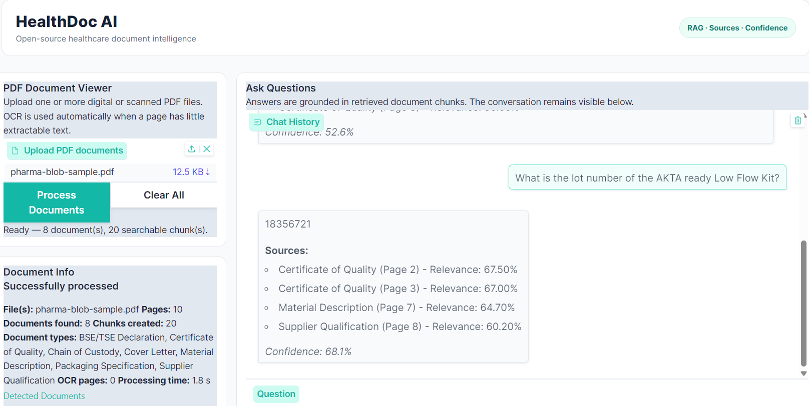
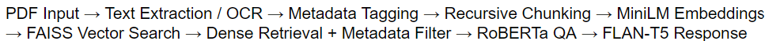

# HealthDoc-AI-RAG
Open-source RAG document intelligence system for pharmaceutical PDFs using OCR, MiniLM embeddings, FAISS, RoBERTa, and FLAN-T5 for source-grounded Q&amp;A.

# HealthDoc AI — Pharmaceutical Document Intelligence with RAG

HealthDoc AI is an open-source Retrieval-Augmented Generation (RAG) system designed to help users quickly retrieve and verify information from complex pharmaceutical PDF documents.

The system supports both digital and scanned PDFs and combines OCR, metadata-aware document processing, semantic search, extractive question answering, and open-source language models to generate source-grounded answers with page-level citations.

## Demo



**Presentation:** [View Project Presentation](https://docs.google.com/presentation/d/1aXLXDQIiyc9TXglzEdl8FYuqud3Vo80_/edit?slide=id.p4#slide=id.p4)

## Problem

Pharmaceutical information is often distributed across multiple document types and PDF formats, including scanned documents.

Finding a specific piece of information can require manually reviewing many pages, while traditional keyword search may miss relevant information or provide limited context.

HealthDoc AI addresses this by allowing users to ask natural-language questions and retrieve answers grounded in the uploaded documents.

## System Architecture

```text
PDF Input
    ↓
Text Extraction / OCR
    ↓
Metadata Tagging
    ↓
Recursive Text Chunking
    ↓
MiniLM Embeddings
    ↓
FAISS Vector Search
    ↓
Dense Retrieval + Metadata Filter
    ↓
RoBERTa Question Answering
    ↓
FLAN-T5 Response Generation
    ↓
Answer + Sources + Confidence Signal
```



## Key Features

- Supports digital and scanned PDFs
- Tesseract OCR fallback for scanned pages
- Automatic pharmaceutical document-type classification
- Page-level metadata and source tracking
- Recursive text chunking with overlap
- Semantic search using SentenceTransformers
- FAISS vector retrieval
- Manual document-type filtering
- Optional keyword-based Auto-Routing
- Extractive question answering with RoBERTa
- Natural-language response generation with FLAN-T5
- Page-level source citations
- Heuristic confidence signal
- Configurable Top-K retrieval
- Interactive Gradio interface

## Technology Stack

| Component | Technology | Configuration |
|---|---|---|
| PDF Processing | PyMuPDF | Digital text extraction |
| OCR | Tesseract OCR | Fallback for pages with <40 extracted characters; 180 DPI |
| Chunking | RecursiveCharacterTextSplitter | 650 characters, 120-character overlap |
| Embeddings | all-MiniLM-L6-v2 | Normalized SentenceTransformer embeddings |
| Vector Search | FAISS IndexFlatIP | Exact inner-product search |
| Retrieval | Dense retrieval + metadata filtering | Top-K = 4 by default; configurable from 1–10 |
| Extractive QA | RoBERTa SQuAD2 | Extracts answer spans from retrieved evidence |
| Generation | FLAN-T5-base | Converts extracted evidence into natural responses |
| Interface | Gradio | Interactive document Q&A application |

## Why RoBERTa + FLAN-T5?

Instead of relying on one model for both finding and writing the answer, HealthDoc AI separates these responsibilities.

**RoBERTa** identifies the exact answer span within the retrieved evidence.

**FLAN-T5-base** uses that answer and its supporting context to produce a concise, natural-language response.

This design was introduced after testing a smaller generative model, which frequently copied retrieved text instead of producing a clear answer. Separating extraction from generation improved control over the final response.

## Retrieval Evaluation

The retrieval pipeline was evaluated using five manually labeled questions from the pharmaceutical test document.

| Metric | Result |
|---|---:|
| Hit Rate@4 | **100%** |
| Precision@4 | **30%** |
| Mean Reciprocal Rank (MRR) | **0.90** |
| Average Retrieval Time | **0.028 sec** |
| Answer Accuracy | **100% (5/5)** |
| Citation Accuracy | **100% (5/5)** |

The evaluation also identified a weakness in keyword-based Auto-Routing. Disabling Auto-Routing improved Hit Rate@4 and MRR on the five-question evaluation set, so Auto-Routing is now optional and OFF by default.

> **Note:** These results are from a small five-question evaluation set and should not be interpreted as general performance across all pharmaceutical documents.

## Example

**Question**

> What is the recommended storage temperature for AKTA ready flow kits?

**HealthDoc AI**

> The recommended storage temperature for standard AKTA ready flow kits is above +5°C. Extended storage below the recommended temperature may lead to brittleness or cracking.

The interface also displays the retrieved source document, page number, relevance score, confidence signal, and number of chunks used.

## Confidence Score

The displayed confidence value is a **heuristic signal**, not a calibrated probability that the answer is correct.

It combines retrieval relevance and question-answering model signals to provide a relative indication of answer support.

A future version could calibrate this score using a larger labeled validation dataset.

## Design Decisions

### Why open-source models?

The system intentionally uses open-source models rather than Gemini or paid APIs to keep the pipeline:

- Reproducible
- Low-cost
- Customizable
- Transparent
- Independent of external paid inference APIs

This approach also provides greater control over each stage of the RAG pipeline, from embeddings and retrieval to answer extraction and generation.

### Why Top-K = 4?

Four chunks were selected as a practical default to balance context coverage and retrieval noise.

Too few chunks may miss important evidence, while too many can introduce irrelevant information. The interface therefore allows users to adjust Top-K from 1 to 10.

Top-K = 4 is a practical default rather than a formally optimized value.

## Current Limitations

### Document Processing
- OCR performance may decrease on low-quality or complex scans.
- Table structure can be lost during plain-text extraction.

### Retrieval
- Keyword-based Auto-Routing can misroute ambiguous questions.
- Top-4 retrieval can still contain irrelevant chunks, reflected in the current Precision@4.

### Scalability
- The FAISS index is not persistent and must be rebuilt after a runtime restart.
- Larger document collections would require persistent and more scalable vector storage.

## Future Improvements

**Short-Term**
- Expand evaluation to 25+ labeled questions across document types.
- Improve table extraction and OCR preprocessing.

**Medium-Term**
- Add reranking and semantic routing to improve retrieval precision.
- Calibrate confidence scores using a larger labeled evaluation set.
- Automatically benchmark retrieval and generation latency.

**Long-Term**
- Move to persistent vector storage for larger document collections.
- Add access controls, monitoring, and enterprise document-system integration.

## Running the Project

The project was developed in Google Colab.

1. Open `HealthDoc_RAG_Chatbot.ipynb` in Google Colab.
2. Run the installation and setup cells.
3. Load the embedding, QA, and generation models.
4. Launch the Gradio interface.
5. Upload one or more PDF documents.
6. Click **Process Documents**.
7. Ask questions about the uploaded documents.

The first run may take additional time while the required open-source models are downloaded.

## Project Structure

```text
healthdoc-ai-rag/
├── README.md
├── HealthDoc_RAG_Chatbot.ipynb
├── assets/
│   ├── healthdoc-ui.png
│   ├── rag-pipeline.png
│   └── evaluation-results.png
├── sample/
│   └── README.md
└── LICENSE
```

## Author

**My Ha**

Data Science & Political Science  
Augustana College

[LinkedIn](https://www.linkedin.com/in/hoan-my-ha/) · [Project Presentation](https://docs.google.com/presentation/d/1aXLXDQIiyc9TXglzEdl8FYuqud3Vo80_/edit?slide=id.p4#slide=id.p4)

## Acknowledgment

Developed as part of the Pfizer Advanced AI-Powered Document Intelligence Externship through Extern.

This repository represents an educational project and prototype and is not an official Pfizer production system.

## Disclaimer

HealthDoc AI is a prototype intended for educational and research purposes. It should not be used to make clinical, regulatory, or medical decisions without appropriate professional review.
